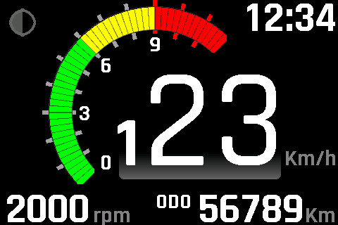
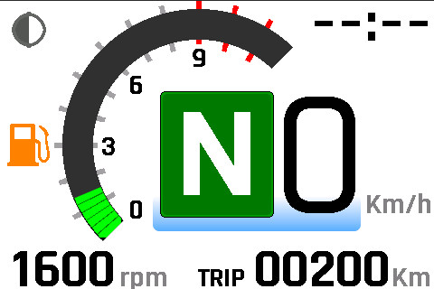

<h1 align="center">ApeTFT.ino</h1>
<p align="center">
  
</p>

<mark>**Note: This project is still under development. Please check the “Status” section before use.**</mark>


## Overview
&nbsp;This project is a TFT dashboard designed for the Honda APE motorcycle, developed using the JC3248W535 hardware, Arduino IDE, LVGL (9.x), and SquareLine Studio.  
&nbsp;The initial goal was to create a trip meter to replace the factory meter, which only had a speedometer and odometer, based on the experience of repeatedly running out of gas...  

>This repository is planned to include multiple branches in the future.  
> `main`: Application core (UI/LVGL logic, Hardware‑independent modules "my..."). 
>>`cpu-all`: whole screen CPU transfer version (ArduinoGFX + JC3248W535-Driver)
>
>>`dma-all`: whole screen DMA transfer version (esp_lcd_axs15231b + esp_lcd_touch)
>
>>`dma-part`: partial DMA transfer version ( future vision )
>
<br><br>

## Feature
<table>
<tr>
<td></td>
<td>

- dark mode for Night rider
- big digital speed meter ( based on hardware pulse input )
- bar segment rpm indicator ( based on hardware pulse input )
- digital rpm meter for idling monitor
- Wi‑Fi synchronized clock (with your smartphone)
- total odometer ( based on hardware pulse input )
 
</td>
</tr>

<tr>
<td></td>
<td>

- light mode for Day rider ( switch via upper-left icon )
- low fuel warning ( based on trip distance )
- gear neutral indicator ( Hardware hi/low input )
- trip meter with touch-reset
- load various settings from the SD card
- 

</td>
</tr>
</table>


## Hardware & Software Stack
| Category | Details | Commercial Use |
|---------|---------|----------------|
| MCU | [ESP32-S3](https://www.espressif.com/en/products/socs/esp32-s3) | Allowed (Espressif license) |
| Dev board | [JC3248W535](https://www.aliexpress.com/item/1005008275169229.html) (IPS3.5in 480x320) | Allowed (hardware) |
| IDE | [Arduino IDE](https://www.arduino.cc/en/software) | Allowed (LGPL/GPL components) |
| Board Package | [ESP32 by Espressif Systems](https://github.com/espressif/arduino-esp32) | Allowed (Apache 2.0) |
| Display Driver | [JC3248W535-Driver by processware](https://github.com/me-processware/JC3248W535-Driver) | Allowed (MIT License) |
| Graphics Library | [ArduinoGFX 1.6.3 by MoonOnOurNation](https://github.com/moononournation/Arduino_GFX) | Allowed (MIT License) |
| UI Framework | [LVGL 9.4](https://lvgl.io/) | Allowed (MIT License) |
| UI Design Tool | [SquareLine Studio](https://squareline.io/) | **Not allowed (assets generated for personal use only)** |
| Fonts | [Radjdhani](https://fonts.google.com/specimen/Rajdhani) (Google Fonts OFL 1.1) | Allowed ([OFL 1.1](src/ui/fonts/OFL.txt))[*] |
---
<br><br>


## <mark>Setup (with Arduino IDE)</mark>
### <u>1. Extract src/***.zip files</u>
- LVGL, GFX, etc...
### <u>2. Connect the PC to the target board via USB</u>
- Make sure the cable supports data transfer, not just charging.
### <u>3. DownLoad Board Information</u>  
- File ->Preferences ->Setting ->Additional boards manager URLs:
https://raw.githubusercontent.com/espressif/arduino-esp32/gh-pages/package_esp32_index.json
### <u>4. Select Board Setting</u>
- Tools->Boards ->esp32 ->ESP32S3 Dev Module  
- Tools->Port ->Select COM#(ESP32 Family Device)
- Tools->USB CDC On Boot: ->Enabled
- Tools->Flash Mode: ->QIO 120MHz
- Tools->Flash Size: ->16MB(128Mb)
- Tools->Partition Scheme: ->Huge App(3MB No OTA/1MB SPIFFS)
- Tools->PSRAM: ->OPI PSRAM
### <u>5. Execute [Upload]</u>
- The build will start, and once it finishes, the upload will begin automatically.
### <u>6. Load the user’s meter settings</u>
- Make & Place "MetSettings.csv" in your SD-card
- Insert SD-card into device
- Restart or reset device
- After confirming that the settings have been applied, remove the SD card.
### <u>extras. Modifying UI with SquareLineStudio</u>
- Extract ref/sqrApeTFT.zip, and open with SquareLineStudio
- File ->Project Settings ->FILE EXPORT:  
UI File Export Path=(your prj root)\src\ui\
LVGL Include Path=..\lvgl\lvgl.h  (* embedded directly into the source code as #include "..\lvgl\lvgl.h")
- Export ->Export UI Files
<br><br>


## <mark>Setup (with PlatformIO)</mark>
- ... In preparation ...
<br><br>


<br><br><br><br>
# Other Detailed information
## Project Structure
```
ApeTFT
  ├─README.md				... this readme
  ├─ref						... reference documents
  │   └─spjApeTFT.zip		... SquareLineStudio UI project
  ├─ApeTFT.ino				... top‑level orchestration layer
  ├─MetSettings.csv			... sample user‑settings file to be placed on the SD card  
  └─src
      * All .c files in this folder will be included in the build.
      ├─GFX Library for Arduino	( for CPU transfer ver.)
      ├─JC3248W535-Driver		( for CPU transfer ver.)
      ├─esp_lcd_axs15231b		( for DMA transfer ver.)
      ├─esp_lcd_touch			( for DMA transfer ver.)
      ├─lvgl
      ├─lv_conf.h			... LVGL configuration
      ├─ui					... SquareLineStudio exports
      │   ├──ui_events.cpp	... user implementation of call function events 
      │   └─ ...
      ├─mySettingMgr.cpp/.h	... user settings loader module (from SD Card)
      ├─myApplMain.cpp/.h	... user application top layer
      ├─my...
      └─myDispCtrl.cpp/.h	... the function that updates LVGL parameters
```


## Out of Scope & Known Issues
These items are commonly expected, but this project does not implement them.
- km / mile unit selection
- CAN bus , OBD support

The following issues are known but will not be fixed.

- Wi‑Fi and clock synchronization retries may cause the meter display to freeze for several seconds if the connection completes during active operation.

- A slight pixel shift occurs when the digit count of the digital speedometer changes. Likely caused by LVGL’s font rendering. A per‑digit UI structure would fix it, but the impact is negligible, so it remains unaddressed.
 
- Because no tearing‑prevention measures are implemented, momentary display artifacts may occur. This is particularly noticeable in the RPM indicator.


## Roadmap
No roadmap. Future work will be done as separate projects.

## Status

The core UI and display functions are fully operational.  
However, several hardware‑dependent features are still under verification.

### Verified
- LVGL rendering (CPU/DMA depending on branch)
- Touch input
- UI navigation and event handling
- SD card settings loader

### Not Yet Verified
- **Pulse‑based speed input**  
  (The input circuit is not finalized, so real‑world pulse testing has not been performed.)
- **Pulse‑based RPM input**  
  (Same reason as above; logic is implemented but untested.)
- **Long‑term stability under vibration**  
  (Bench‑tested only; no extended on‑vehicle test yet.)

### Notes
These features may behave differently once the actual input circuitry is completed.  
Use caution when integrating this project into a real vehicle.

## Disclaimer
This software is provided as-is, without any warranty of any kind.  
The author is not liable for any loss, damage, malfunction, or injury arising from the installation or use of this project.  
You are solely responsible for any risks associated with its use.

## Author
- Ksamochi in Japan
- GitHub: 	https://github.com/ksamochi
- License: 	MIT
